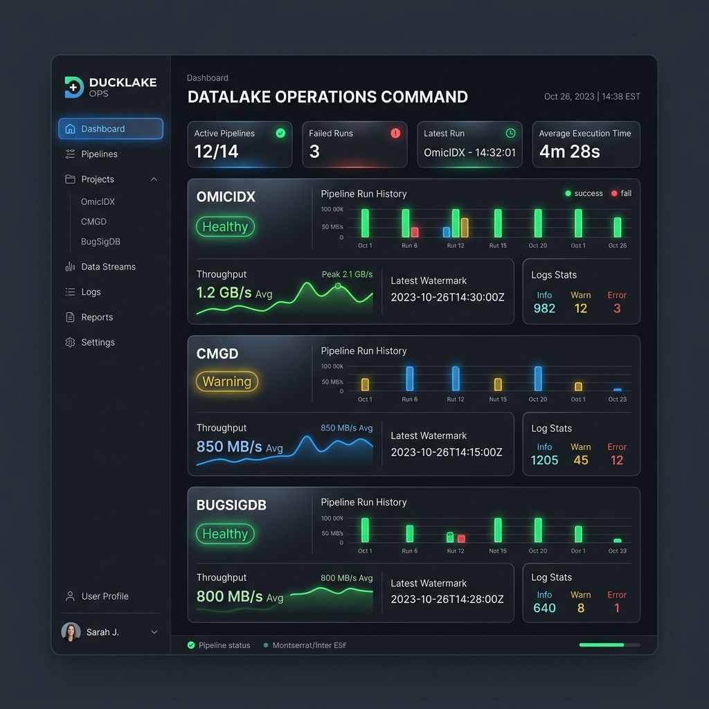

# Unified Operations Dashboard & Scheduling System

This document outlines the architecture for scheduling ingestions, capturing structured logs, and serving a unified operations dashboard across all projects (OmicIDX, CMGD, BugSigDB) writing to the DuckLake catalog.

---

## 1. Context & Motivation

As the catalog scales across multiple distinct projects and writers (attributing to `omicidx`, `cdsci`, etc.), we require unified operations visibility. Rather than managing complex, resource-heavy orchestration frameworks (like Prefect or Dagster) independently for each project, we leverage **catalog-adjacent operational metadata** (`ops.lake_ops`) to unify tracking, scheduling, and auditing.

---

## 2. Visual Design Mockup

The unified operational dashboard gathers metrics, throughput, latest watermarks, and structured logging stats across all active datasets:



---

## 3. Architecture Overview

The system consists of three decoupled layers:

1. **Lightweight Job Scheduling**: Triggers ingestions via standard cron or native OS managers.
2. **Structured Log Capture (ClickHouse)**: Aggregates real-time run logs from all pipeline runs.
3. **Operations Web Dashboard (FastAPI/React)**: Reads `lake_ops` metadata and ClickHouse logs to render a unified view.

```
[Systemd Timers / Cronicle] (Trigger runs)
            │
            ▼
     [Container Jobs] (OmicIDX, CMGD, BugSigDB)
            │
            ├─── writes data ────► [DuckLake Catalog]
            ├─── writes runs ────► [lake_ops (Postgres/DB)]
            └─── emits JSON ─────► [Vector shipper] ──► [ClickHouse Logs]
```

---

## 4. Scheduling Specification

Instead of a centralized orchestrator, job scheduling is triggered natively by the host OS or a self-contained web runner:

### Option A: Systemd Timers (OS Native)
Runs tasks in isolated oneshot units with strict resource limits and automated dependency chaining.

Example service file (`/etc/systemd/system/omicidx-pipeline.service`):
```ini
[Unit]
Description=OmicIDX Daily Pipeline Ingestion
After=docker.service

[Service]
Type=oneshot
WorkingDirectory=/home/davsean/Documents/git/omicidx
EnvironmentFile=/home/davsean/Documents/git/omicidx/.env
ExecStart=/usr/bin/docker compose run --rm worker-cli omicidx-prefect run daily
StandardOutput=journal
StandardError=journal
```

Example timer file (`/etc/systemd/system/omicidx-pipeline.timer`):
```ini
[Unit]
Description=Trigger OmicIDX Ingestion Daily at 02:00 UTC

[Timer]
OnCalendar=*-*-* 02:00:00 UTC
Persistent=true

[Install]
WantedBy=timers.target
```

### Option B: Cronicle (Web Interface Scheduler)
For teams requiring a visual run calendar without the overhead of heavy workflow engines. It executes simple CLI commands, collects output, draws run-time charts, and triggers email/Slack alerts.

---

## 5. Log Capture Specification (ClickHouse)

All ingestion scripts write structured JSON logs to standard output. 

### Logger Configuration (Python)
```python
import structlog
import logging

def setup_json_logging():
    structlog.configure(
        processors=[
            structlog.stdlib.add_log_level,
            structlog.processors.TimeStamper(fmt="iso", utc=True),
            structlog.processors.JSONRenderer()
        ],
        logger_factory=structlog.stdlib.LoggerFactory(),
        wrapper_class=structlog.stdlib.BoundLogger,
        cache_logger_on_first_use=True,
    )
```

Example output:
```json
{
  "timestamp": "2026-07-10T14:47:12.105Z",
  "level": "info",
  "event": "merge_completed",
  "writer": "omicidx",
  "source": "sra",
  "target": "lake.omicidx.sra_study",
  "run_id": "9a38f154-e0b2-4d92-8dbf-a7201c10d3f8",
  "rows": 48201
}
```

### ClickHouse Table Schema
Logs are collected by a log shipper (e.g., Vector) and saved to a unified MergeTree table:

```sql
CREATE TABLE IF NOT EXISTS lake_ops.structured_logs (
    timestamp DateTime64(3, 'UTC'),
    level LowCardinality(String),
    event String,
    writer LowCardinality(String),
    source LowCardinality(String),
    target LowCardinality(String),
    run_id String,
    rows Nullable(UInt64),
    error_message Nullable(String),
    traceback Nullable(String),
    message String
) ENGINE = MergeTree()
ORDER BY (writer, source, timestamp);
```

---

## 6. Unified Dashboard Specifications

The backend dashboard API connects directly to the shared Postgres database (for `lake_ops` state) and ClickHouse (for log queries).

### Key Dashboard SQL Queries

#### 1. Ingestion Performance and History
Get the last 50 execution runs across all projects:
```sql
SELECT 
    writer,
    source,
    target,
    status,
    snapshot_before,
    snapshot_after,
    rows_after,
    started_at,
    finished_at,
    (finished_at - started_at) AS duration,
    error
FROM ops.lake_ops.run
ORDER BY started_at DESC
LIMIT 50;
```

#### 2. DuckLake Snapshot Correlation
Resolve physical catalog snapshot history and join it against ingestion metadata:
```sql
SELECT 
    s.snapshot_id,
    s.timestamp,
    s.author,
    s.message,
    r.target,
    r.rows_after,
    r.status
FROM lake.snapshots() s
LEFT JOIN ops.lake_ops.run r 
  ON s.extra_info->>'run_id' = r.run_id
ORDER BY s.timestamp DESC;
```

#### 3. Log Retrieval (per Run ID)
Fetch raw execution logs for a clicked dashboard card:
```sql
SELECT timestamp, level, event, message, error_message, traceback
FROM lake_ops.structured_logs
WHERE run_id = :run_id
ORDER BY timestamp ASC;
```
