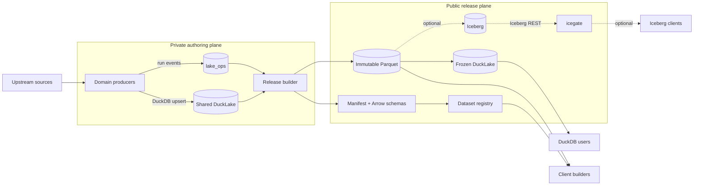
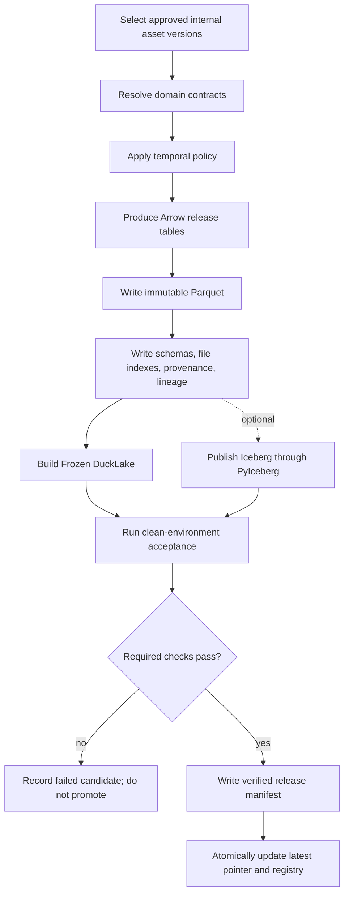
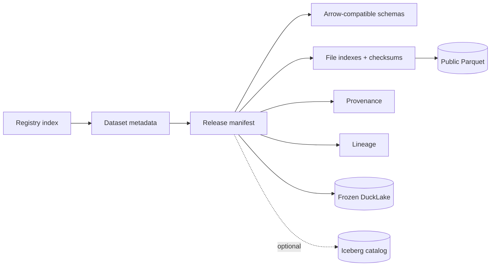

# Scientific Lake Publication Platform

Status: **Draft architecture proposal**

Scope: `cdsci-lake`, `bioc-on-ice`, `cancer-on-ice`, optional Iceberg publication, and `icegate`

Primary audience: platform maintainers, public-data-product maintainers, client builders, and operators

> This document proposes an architecture. It records current implementation evidence where relevant, but it is not yet a replacement for the repositories' accepted ADRs or specifications. Decisions that contradict an accepted ADR or `SPEC.md` must update that governing document when implemented.

## Executive summary

The platform should optimize for two public outcomes:

1. **DuckDB users can discover a dataset, attach a Frozen DuckLake, and query it with almost no infrastructure knowledge.**
2. **Client builders and downloaders can discover releases, inspect machine-readable metadata, and retrieve immutable Parquet without understanding DuckLake.**

The resulting hierarchy is:

1. **Internal authoring authority:** one shared, private DuckLake managed by `cdsci-lake`.
2. **Canonical public release:** an immutable manifest, Arrow-compatible schemas, provenance, lineage, and Parquet files.
3. **Primary public query path:** a Frozen DuckLake generated for each release.
4. **Machine interface:** a dataset registry exposing datasets, releases, tables, schemas, files, statistics, provenance, and lineage.
5. **Semantic history:** explicit temporal policies, including release-scoped Type 2 history.
6. **Optional interoperability:** Apache Iceberg, written only through PyIceberg, when a concrete consumer requires it.

DuckLake and Iceberg are access adapters over a scientific release. Neither format alone defines the release.

An interactive version of the platform architecture is available at [diagrams/publication-platform-compact.html](diagrams/publication-platform-compact.html). Its validated source specification is [diagrams/publication-platform-compact.architecture.json](diagrams/publication-platform-compact.architecture.json).

---

## 1. Context

### 1.1 Existing repositories

| Repository | Intended responsibility |
|---|---|
| `cdsci-lake` | Shared internal DuckLake, producer write contract, operations ledger, transforms, lineage providers, and publication mechanics |
| `bioc-on-ice` | Biological public product: domain schemas, identifier semantics, genome/taxon scopes, release history, R/MCP clients |
| `cancer-on-ice` | Cancer public product: geography, measures, suppression, source releases, catchments, and public-aggregate licensing gates |
| `icegate` | Stateless Iceberg REST gateway: authentication, routing, config rewriting, CORS, and credential vending |

### 1.2 Existing strengths

`cdsci-lake` already has a useful shared substrate:

- `lake_connect()` hides local versus Postgres-catalog DuckLake attachment, R2 credentials, DuckDB limits, spilling, and retries.
- `upsert()` implements null-safe keyed change detection and idempotent DuckLake writes.
- `ops.run()` records run identity, status, snapshots, row counts, host, and errors.
- watermarks and source registration support multiple producers.
- snapshot commit metadata attributes writes to a writer, source, target, version, operation, and run.

`bioc-on-ice` and `cancer-on-ice` have stronger public-product behavior:

- declared schemas and column documentation;
- release-level Type 2 history in rows;
- writer-scoped filtered overwrite;
- provenance manifests;
- public Iceberg access through R2 Data Catalog and icegate;
- domain-specific safety checks.

### 1.3 Immediate safety issue

`cdsci.lake.transform.targets._publish_iceberg()` currently performs DuckDB `DELETE` followed by `INSERT` against an Iceberg REST catalog.

That path must not be used for bioc-on-ice, cancer-on-ice, or another production public catalog. Both public repositories require PyIceberg as the sole writer after a real DuckDB write left invalid position-delete metadata in a live table.

The consolidated rule is:

```text
Internal DuckLake writes    → DuckDB / DuckLake
Public Parquet writes       → release builder
Frozen DuckLake writes      → DuckDB / DuckLake, into a new immutable artifact
Public Iceberg writes       → PyIceberg only
```

---

## 2. Goals and non-goals

### 2.1 Goals

- Make `DuckDB → ATTACH → SELECT` the simplest public query experience.
- Publish immutable Parquet that is independently downloadable.
- Give client builders a stable machine-readable release contract.
- Implement common mechanics once across the three lakes.
- Preserve domain ownership of scientific meaning.
- Make release history and current-state semantics explicit.
- Correlate source runs, internal DuckLake versions, public artifacts, and acceptance results.
- Support optional Iceberg without making it the conceptual center.
- Keep tests offline by default while maintaining a bounded live-publication acceptance suite.

### 2.2 Non-goals

- A universal source-ingestion framework.
- Moving biological or cancer schemas into `cdsci-lake`.
- Turning icegate into a SQL engine or object proxy.
- Requiring SQLMesh for every transform.
- Building a centralized workflow orchestrator before simpler schedulers fail.
- Claiming atomic transactions across an entire multi-table public release.
- Publishing internal DuckLake catalogs or internal object paths.
- Requiring Iceberg when no real client needs it.

---

## 3. Architecture

### 3.1 System architecture



### 3.2 Authority boundaries

| Concern | Authority |
|---|---|
| Mutable source-faithful internal state | Shared DuckLake |
| Run state, watermarks, asset identity, publication receipts | `lake_ops` |
| Scientific table meaning | Owning domain repository |
| Public release contents | Immutable release manifest |
| Public physical bytes | Release-owned Parquet objects |
| Primary interactive query path | Frozen DuckLake |
| Optional Iceberg catalog state | PyIceberg publisher |
| Iceberg auth/routing/vending | icegate |
| Public discovery | Dataset registry |

### 3.3 Release workflow



### 3.4 Data versus metadata



---

## 4. Public object layout

A public product should use immutable, release-qualified paths.

```text
https://data.example.org/
  catalog.json
  datasets/
    bioc-annotation/
      dataset.json
      latest.json
      releases/
        2026.10/
          manifest.json
          provenance.json
          lineage.json
          catalog.ducklake
          tables/
            annotation.gene/
              schema.json
              files.json
              data/
                part-00000.parquet
                part-00001.parquet
            annotation.transcript/
              schema.json
              files.json
              data/
                part-00000.parquet
```

Rules:

1. A published release directory is immutable.
2. `latest.json` is a small pointer, never the release itself.
3. Frozen DuckLake may reference only objects inside the public release domain.
4. Internal Postgres, R2 S3, filesystem, and credential-bearing URLs are forbidden.
5. Every listed file has byte size, checksum, row count where practical, and media type.
6. A release manifest is not marked `published` until required acceptance checks pass.
7. Optional Iceberg locations are additional access methods, not the only way to resolve files or schemas.

---

## 5. Machine-readable publication contract

### 5.1 Dataset metadata

```json
{
  "spec_version": "1.0",
  "id": "bioc-annotation",
  "title": "biocOnIce Annotation",
  "description": "Versioned biological annotation tables",
  "publisher": "biocOnIce",
  "licenses": ["source-specific"],
  "homepage": "https://example.org/bioc-on-ice",
  "current_release": "2026.10",
  "releases": "releases/index.json"
}
```

### 5.2 Release manifest

```json
{
  "spec_version": "1.0",
  "dataset": "bioc-annotation",
  "release": "2026.10",
  "status": "published",
  "published_at": "2026-10-15T18:32:00Z",
  "run_id": "0199...",
  "source_asset_versions": [
    {
      "ref": "ducklake://lake/ensembl/gene",
      "version": "snapshot:812"
    }
  ],
  "artifacts": {
    "parquet": {
      "base_uri": "tables/",
      "status": "verified"
    },
    "ducklake": {
      "uri": "catalog.ducklake",
      "status": "verified"
    },
    "iceberg": {
      "endpoint": "https://icegate.example.org",
      "warehouse": "bioconice",
      "status": "verified",
      "required": false
    }
  },
  "tables": [
    {
      "name": "annotation.gene",
      "description": "Ensembl-defined gene versions",
      "grain": "one gene version per genome, source, and validity interval",
      "primary_key": [
        "gene_id",
        "taxon_id",
        "source",
        "genome_id",
        "valid_from"
      ],
      "temporal_model": "scd2_release",
      "schema": "tables/annotation.gene/schema.json",
      "files": "tables/annotation.gene/files.json",
      "row_count": 1234567,
      "schema_digest": "sha256:...",
      "license": "ensembl-no-restrictions"
    }
  ],
  "provenance": "provenance.json",
  "lineage": "lineage.json"
}
```

### 5.3 File index

```json
{
  "table": "annotation.gene",
  "release": "2026.10",
  "materialization": "release_snapshot",
  "files": [
    {
      "uri": "data/part-00000.parquet",
      "size": 9843210,
      "sha256": "...",
      "rows": 122880,
      "content_type": "application/vnd.apache.parquet"
    }
  ]
}
```

The `materialization` field must distinguish at least:

- `history`: files contain all SCD2 intervals and require a release predicate;
- `release_snapshot`: files contain only rows valid at this release;
- `append_immutable`: files are immutable events/artifacts with no current-state projection.

A `/files` interface must never imply that physical history files are a release snapshot when they still require a row predicate.

---

## 6. Shared module design

The shared package should centralize mechanics while leaving contracts and source logic in the owning repositories.

```text
cdsci.lake.runtime       DuckLake connection, credentials, limits
cdsci.lake.ops           runs, assets, versions, lineage, receipts
cdsci.lake.contracts     semantic and temporal contracts
cdsci.lake.history       SCD2 planning and validation
cdsci.lake.lineage       normalized lineage + provider adapters
cdsci.lake.publish       release builder + format adapters
cdsci.lake.telemetry     structured run events
```

Recommended optional dependency groups:

```text
cdsci-lake                 read/runtime substrate
cdsci-lake[ingest]         cdsci source ingestors
cdsci-lake[transform]      SQLMesh or transform implementation
cdsci-lake[publish]        PyArrow, Parquet, PyIceberg publication
cdsci-lake[telemetry]      optional log/trace exporters
```

### 6.1 Contracts

```python
from __future__ import annotations

from dataclasses import dataclass, field
from datetime import datetime
from enum import StrEnum
from pathlib import PurePosixPath
from typing import Any, BinaryIO, Iterable, Mapping, Protocol, Sequence
from uuid import UUID

import pyarrow as pa


JsonValue = None | bool | int | float | str | list["JsonValue"] | dict[str, "JsonValue"]


class TemporalModel(StrEnum):
    APPEND_IMMUTABLE = "append_immutable"
    UPSERT_LATEST_SNAPSHOT = "upsert_latest_snapshot"
    SCD2_RELEASE = "scd2_release"
    SCD2_BITEMPORAL = "scd2_bitemporal"


class Materialization(StrEnum):
    HISTORY = "history"
    RELEASE_SNAPSHOT = "release_snapshot"
    APPEND_IMMUTABLE = "append_immutable"


@dataclass(frozen=True)
class ColumnContract:
    name: str
    arrow_type: pa.DataType
    description: str
    nullable: bool
    identifier_namespace: str | None = None
    units: str | None = None
    coordinate_system: str | None = None
    null_meaning: str | None = None
    enum: tuple[str, ...] = ()


@dataclass(frozen=True)
class TableContract:
    name: str
    description: str
    grain: str
    primary_key: tuple[str, ...]
    temporal_model: TemporalModel
    owner: str
    license: str
    columns: tuple[ColumnContract, ...]
    sort_by: tuple[str, ...] = ()
    partition_by: tuple[str, ...] = ()
    examples: tuple[str, ...] = ()
    properties: Mapping[str, str] = field(default_factory=dict)

    def arrow_schema(self) -> pa.Schema:
        ...

    def validate(self, incoming: pa.Schema) -> None:
        ...


@dataclass(frozen=True)
class DatasetContract:
    id: str
    title: str
    description: str
    publisher: str
    tables: Mapping[str, TableContract]
    required_artifacts: frozenset[str] = frozenset({"parquet", "ducklake"})
```

The domain repository constructs these objects. Shared code validates and renders them.

### 6.2 Asset and lineage identities

```python
class AssetKind(StrEnum):
    TABLE = "table"
    MODEL = "model"
    URL = "url"
    FILE = "file"
    ARTIFACT = "artifact"
    DATASET_RELEASE = "dataset_release"


@dataclass(frozen=True)
class AssetRef:
    kind: AssetKind
    name: str
    version: str | int | None = None


class LineageProvider(StrEnum):
    DECLARED = "declared"
    SQLGLOT = "sqlglot"
    SQLMESH = "sqlmesh"


class LineageConfidence(StrEnum):
    EXACT = "exact"
    TABLE_ONLY = "table_only"
    UNRESOLVED = "unresolved"


@dataclass(frozen=True)
class LineageEdge:
    upstream: AssetRef
    downstream: AssetRef
    provider: LineageProvider
    confidence: LineageConfidence
    run_id: UUID
    upstream_column: str | None = None
    downstream_column: str | None = None
    expression: str | None = None
```

Provider-specific lineage is adapted to this vocabulary. SQLMesh remains authoritative for SQLMesh detail; SQLGlot is used for inline SQL outside SQLMesh; URL/file roots are explicit declarations.

### 6.3 Run context and operational sink

```python
@dataclass(frozen=True)
class RunContext:
    run_id: UUID
    writer: str
    job: str
    release: str | None
    trace_id: str | None = None
    parent_run_id: UUID | None = None


class OpsSink(Protocol):
    def start_run(self, run: RunContext, metadata: Mapping[str, JsonValue]) -> None: ...
    def finish_run(
        self,
        run: RunContext,
        *,
        status: str,
        rows: int | None,
        error: str | None,
    ) -> None: ...
    def record_asset_version(
        self,
        asset: AssetRef,
        *,
        run: RunContext,
        metadata: Mapping[str, JsonValue],
    ) -> None: ...
    def record_lineage(self, edges: Iterable[LineageEdge]) -> None: ...
    def record_publication(self, receipt: "PublicationReceipt") -> None: ...
```

`lake_ops` is the production adapter. A local DuckDB adapter provides an offline test substitute.

### 6.4 Type 2 history

```python
@dataclass(frozen=True)
class CompleteScope:
    dimensions: Mapping[str, str | int | bool]


@dataclass(frozen=True)
class ReleaseCoordinate:
    product: str
    release: str


@dataclass(frozen=True)
class SCD2Policy:
    business_key: tuple[str, ...]
    valid_from: str = "valid_from"
    valid_to: str = "valid_to"
    same_release: str = "replace_draft"
    tracked_columns: tuple[str, ...] | None = None


@dataclass(frozen=True)
class HistoryPlan:
    rows: pa.Table
    inserted: int
    changed: int
    retired: int
    reopened: int
    unchanged: int


class HistoryPlanner(Protocol):
    def plan(
        self,
        *,
        current_scope: pa.Table,
        incoming_complete_scope: pa.Table,
        scope: CompleteScope,
        coordinate: ReleaseCoordinate,
        policy: SCD2Policy,
        allow_draft_drop: bool = False,
    ) -> HistoryPlan: ...
```

The planner is pure Arrow/DuckDB computation. It does not know PyIceberg, R2, DuckLake, or domain schemas.

### 6.5 Release model

```python
@dataclass(frozen=True)
class SourceArtifact:
    source: str
    artifact: str
    source_version: str | None
    version_method: str
    uri: str
    retrieved_at: datetime
    checksum: str | None = None
    etag: str | None = None
    last_modified: str | None = None


@dataclass(frozen=True)
class ReleaseTable:
    contract: TableContract
    batches: pa.RecordBatchReader
    materialization: Materialization
    row_count: int | None = None
    statistics: Mapping[str, JsonValue] = field(default_factory=dict)


@dataclass(frozen=True)
class Release:
    dataset: DatasetContract
    release: str
    tables: Mapping[str, ReleaseTable]
    provenance: tuple[SourceArtifact, ...]
    lineage: tuple[LineageEdge, ...]
    run: RunContext
```

### 6.6 Publication adapters

```python
class ArtifactStatus(StrEnum):
    STAGED = "staged"
    VERIFIED = "verified"
    PUBLISHED = "published"
    FAILED = "failed"


@dataclass(frozen=True)
class PublicationReceipt:
    dataset: str
    release: str
    format: str
    destination: str
    schema_digest: str
    run_id: UUID
    status: ArtifactStatus
    row_counts: Mapping[str, int]
    checksums: Mapping[str, str] = field(default_factory=dict)
    version: str | None = None
    details: Mapping[str, JsonValue] = field(default_factory=dict)


class PublicationAdapter(Protocol):
    name: str

    def stage(self, release: Release, destination: "ReleaseDestination") -> PublicationReceipt:
        ...

    def verify(
        self,
        release: Release,
        receipt: PublicationReceipt,
        destination: "ReleaseDestination",
    ) -> PublicationReceipt:
        ...


@dataclass(frozen=True)
class ReleaseDestination:
    base_uri: str
    release_prefix: PurePosixPath
    public_base_url: str


class ReleasePublisher:
    def __init__(
        self,
        *,
        object_store: "ObjectStore",
        manifest_writer: "ManifestWriter",
        adapters: Sequence[PublicationAdapter],
        ops: OpsSink,
    ) -> None:
        ...

    def publish(self, release: Release, destination: ReleaseDestination) -> tuple[PublicationReceipt, ...]:
        """Stage, verify, write the final manifest, then promote pointers.

        A failed required adapter prevents release promotion. Optional adapters
        may fail without invalidating the canonical Parquet release, but their
        failed status remains visible in the manifest and operations ledger.
        """
        ...
```

Initial adapters:

- `ParquetReleaseAdapter` — required;
- `FrozenDuckLakeAdapter` — required for the primary UX once accepted;
- `RegistryAdapter` — required;
- `PyIcebergAdapter` — optional and PyIceberg-only.

### 6.7 Object store interface

```python
class ObjectStore(Protocol):
    def put_if_absent(
        self,
        path: PurePosixPath,
        body: bytes | BinaryIO,
        *,
        content_type: str,
        metadata: Mapping[str, str] = {},
    ) -> None: ...

    def head(self, path: PurePosixPath) -> "ObjectMetadata": ...
    def get(self, path: PurePosixPath) -> BinaryIO: ...
    def copy_pointer(self, path: PurePosixPath, document: bytes) -> None: ...
```

`put_if_absent` is the default for release-owned objects. Only pointer paths such as `latest.json` may be replaced.

---

## 7. Temporal standards

### 7.1 `upsert_latest_snapshot`

Use for internal DuckLake silver tables.

- One mutable current row per natural key.
- Null-safe key matching.
- Update only when tracked non-key values differ.
- DuckLake snapshots preserve prior values while retained.
- Snapshot expiry can destroy historical values.
- A snapshot/version column means “last changed,” not a validity interval.

### 7.2 `scd2_release`

Use for public history that must reconstruct a named catalog release.

- The business key identifies the logical record.
- The row key is the business key plus `valid_from`.
- Attribute change closes the old interval and opens a new one.
- Intervals are `[valid_from, valid_to)`.
- At most one current row exists per business key.
- Intervals may not overlap.
- Incoming data is complete inside a declared writer scope.
- Reappearance after retirement opens a new interval.
- A correction within the same unpublished release replaces the draft.
- Once published, a release is immutable; corrections use a successor release.

### 7.3 `append_immutable`

Use for release manifests, provenance artifacts, audit receipts, and immutable event sources. Existing records are never revised.

### 7.4 `scd2_bitemporal`

Use only when an upstream source supplies meaningful effective dates.

- `effective_from` / `effective_to` represent source-world time.
- `valid_from` / `valid_to` represent publication-system time.
- Cancer `period_start` / `period_end` remain observation-period fields, not bitemporal validity.
- `source_release` remains the upstream edition identifier.

---

## 8. Operations, scheduling, logging, and tracing

### 8.1 Scheduling

Actual triggers stay near the owning repository:

- systemd timers;
- GitHub Actions;
- cloud scheduler;
- Cronicle if a visual trigger surface becomes necessary.

The shared layer owns job metadata and due/late calculation, not command execution.

```python
@dataclass(frozen=True)
class JobSpec:
    name: str
    writer: str
    command: tuple[str, ...]
    cadence: str
    timeout_seconds: int
    expected_lag_seconds: int
    owner: str
```

Generate systemd units only after several jobs prove a shared nontrivial shape. Until then, validate existing units and record their runs uniformly.

### 8.2 Structured events

Every CLI should optionally emit one JSON object per event to stdout/stderr.

Required fields:

```json
{
  "timestamp": "2026-10-15T18:32:00.123Z",
  "level": "info",
  "event": "publish_completed",
  "run_id": "0199...",
  "trace_id": "...",
  "writer": "bioc-on-ice",
  "job": "ensembl",
  "asset": "release://bioc-annotation/2026.10/annotation.gene",
  "release": "2026.10",
  "rows": 1234567,
  "status": "success",
  "duration_ms": 4210
}
```

Rules:

- libraries remain silent until configured;
- logs never contain credentials, presigned URLs, raw authorization headers, or SQL containing secrets;
- the JSON event contract is stable regardless of Vector, journald, ClickHouse, or another backend;
- the operations dashboard must show captured logs, not synthesize fake log lines from run rows.

### 8.3 Trace boundaries

A publication trace may cover:

```text
extract → internal write → transform → release build → artifact acceptance → promotion
```

A public query days later is a separate trace. icegate request IDs may be correlated with query telemetry but are not descendants of the publication run.

---

## 9. Dataset registry and icegate

### 9.1 Registry interface

A registry may expose paths such as:

```text
GET /datasets
GET /datasets/{dataset}
GET /datasets/{dataset}/releases
GET /datasets/{dataset}/releases/{release}
GET /datasets/{dataset}/releases/{release}/tables
GET /datasets/{dataset}/releases/{release}/tables/{table}
GET /datasets/{dataset}/releases/{release}/tables/{table}/schema
GET /datasets/{dataset}/releases/{release}/tables/{table}/files
```

The first implementation should be static JSON on public R2 or Cloudflare Pages. Add a Worker only when search, filtering, or content negotiation justifies it.

### 9.2 icegate remains protocol-specific

The current icegate should remain an Iceberg REST gateway:

- authentication and authorization;
- catalog routing;
- config URI/prefix rewrite;
- backend token substitution;
- storage credential vending;
- CORS and request telemetry.

If “IceGate” becomes the umbrella product name, the existing gateway becomes its Iceberg protocol adapter. The dataset registry remains a separate module and contract rather than opportunistic proprietary routes inside the transparent REST proxy.

---

## 10. Domain ownership

### 10.1 `bioc-on-ice`

Keeps:

- biological table definitions;
- identifier namespaces and Bioregistry mappings;
- genome, taxon, assembly, and source scopes;
- annotation joins and biological validity;
- ontology interpretation;
- Bioconductor/R and MCP interfaces;
- public product selection and citation.

### 10.2 `cancer-on-ice`

Keeps:

- suppression sentinels and `value_status` invariants;
- geography vintages and crosswalk semantics;
- measure, stratum, facility, and catchment models;
- observation period versus source release versus catalog validity;
- aggregate-only and license gates;
- cancer-site and prevention mappings.

### 10.3 `cdsci-lake`

Keeps:

- shared internal DuckLake connection and maintenance;
- internal `upsert_latest_snapshot` mechanics;
- producer registrations and watermarks;
- source-specific ingestors owned by cdsci;
- shared operational contracts;
- lineage provider adapters;
- common publication mechanics.

### 10.4 `icegate`

Keeps only Iceberg REST gateway concerns. It does not own release manifests, scheduling, lineage, semantic contracts, or Frozen DuckLake generation.

---

## 11. Acceptance testing strategy

The platform spans several lakes and several access paths. Acceptance must verify the complete published behavior, not only isolated libraries.

### 11.1 Test levels

| Level | Environment | Purpose | Frequency |
|---|---|---|---|
| Unit | In-memory Arrow/DuckDB | Pure history, manifest, contract, and lineage logic | Every commit |
| Offline integration | Local DuckLake, local PyIceberg catalog, fixture files | Repository pipelines without network access | Every PR |
| Local publication acceptance | Temporary HTTP server over generated release | Frozen DuckLake, direct Parquet, registry behavior | Every PR touching publication |
| Live non-destructive | Public R2 release/canary | CORS, Range GET, public attachment, registry freshness | Scheduled and pre-release |
| Isolated destructive/security | Disposable R2 bucket/catalog | Write denial, credential scope, failed promotion, Iceberg writer behavior | Before release and on infrastructure changes |

Normal repository tests remain offline. Live tests use dedicated canary data and never mutate production releases.

### 11.2 Cross-lake acceptance matrix

| Capability | Internal cdsci DuckLake | bioc public release | cancer public release | Optional Iceberg |
|---|---:|---:|---:|---:|
| Idempotent source write | Required | N/A | N/A | N/A |
| Run and snapshot attribution | Required | Required publication receipt | Required publication receipt | Required snapshot properties |
| Immutable release manifest | N/A | Required | Required | Referenced from manifest |
| Anonymous Parquet GET/HEAD/Range | N/A | Required | Required | Client dependent |
| Frozen DuckLake attach | N/A | Required | Required | N/A |
| SCD2 release reconstruction | Input/version evidence | Required | Required | Same logical rows |
| Domain safety gates | License metadata | Biological contracts | Suppression + aggregate-only | Must preserve product result |
| Registry discovery | Internal assets only | Required | Required | Optional access method listed |
| Clean-environment restore | Internal backup test | Required | Required | Required when published |

### 11.3 Internal DuckLake acceptance

For each producer fixture:

1. First `upsert` creates the expected table and one attributed snapshot.
2. Re-running identical input adds no snapshot and records an idempotent run.
3. Changing one tracked attribute changes only that key and creates a new snapshot.
4. A nullable key matches with `IS NOT DISTINCT FROM` and does not duplicate.
5. Snapshot commit metadata contains writer, source, target, version, operation, and run ID.
6. `lake_ops.run` records before/after snapshots and row count.
7. Watermark updates name the run that set them.
8. A producer cannot ambiguously claim a source name already registered to another writer.
9. Read-only connections cannot write.
10. Maintenance defaults to dry-run and respects authorization and producer scope.

### 11.4 SCD2 conformance suite

The same parameterized conformance suite runs against at least one bioc table and one cancer table.

| Scenario | Required result |
|---|---|
| New business key | Open interval at release R |
| Identical row in R+1 | Existing interval remains unchanged |
| Attribute change | Old interval closes at R+1; new interval opens at R+1 |
| Missing from complete scope | Current interval closes at R+1 |
| Retired key reappears | New non-overlapping interval opens |
| Same-release correction | Draft row replaced; no zero-length historical interval |
| Out-of-order published release | Rejected |
| Duplicate incoming business key | Rejected before write |
| Incoming row outside declared scope | Rejected before write |
| Another writer's scope | Untouched |
| Coordinate-bearing alternate assembly | Untouched unless named by scope |
| Join at release R | Exactly one matching version per business key |

Postconditions:

```text
at most one valid_to IS NULL row per business key
no overlapping validity intervals
row key uniqueness = business key + valid_from
all incoming rows satisfy CompleteScope
```

### 11.5 Release-builder acceptance

1. Two builds from identical release inputs produce identical logical manifests and schema digests.
2. Release file paths are immutable and release-qualified.
3. `put_if_absent` rejects replacing an existing release object with different bytes.
4. File indexes include URL, size, checksum, media type, and row count where available.
5. Every manifest table has a schema, grain, primary key, temporal model, owner, license, and description.
6. All relative links resolve under the release prefix.
7. No manifest or Frozen DuckLake metadata contains private bucket names, local paths, credentials, or internal Postgres locations.
8. A required adapter failure prevents `latest.json` and registry promotion.
9. An optional Iceberg failure is visible but does not invalidate a verified Parquet/Frozen DuckLake release unless the product contract marks Iceberg required.
10. Promotion is idempotent.
11. Rebuilding a published release with different semantic content is rejected; a correction requires a successor release.

### 11.6 Frozen DuckLake acceptance

Run in a clean temporary environment with no internal credentials:

```sql
INSTALL ducklake;
LOAD ducklake;
ATTACH 'http://127.0.0.1:<port>/catalog.ducklake' AS published (TYPE DUCKLAKE);
SHOW ALL TABLES;
SELECT count(*) FROM published.<schema>.<table>;
```

Required checks:

1. Attach succeeds over HTTP/HTTPS without Postgres or R2 S3 credentials.
2. Every manifest table is discoverable.
3. Every table can execute `SELECT count(*)` and a bounded sample query.
4. Counts match the release manifest.
5. Arrow schemas match published schema digests.
6. Every referenced object belongs to the release's public domain/prefix.
7. HTTP Range requests work for Parquet.
8. Browser CORS permits `GET`, `HEAD`, and required Range headers.
9. A published release remains queryable after `latest.json` points elsewhere.
10. The catalog opens read-only; attempted mutation fails.

### 11.7 Direct Parquet acceptance

Use PyArrow, DuckDB `read_parquet`, and at least one non-DuckDB client path where practical.

1. Every file is anonymously retrievable.
2. `HEAD` returns expected length and content type.
3. Byte-range retrieval succeeds.
4. SHA-256 matches the file index.
5. The union of files has the manifest row count.
6. Physical schema is compatible with the published Arrow schema.
7. Release-snapshot files contain only rows valid at that release.
8. History files are explicitly labeled and reconstruct the release using the published predicate.
9. Partition/statistics metadata does not claim pruning guarantees absent from the files.
10. A downloader can retrieve the release without DuckDB or DuckLake knowledge.

### 11.8 Registry acceptance

1. `/datasets` includes every promoted dataset and no failed candidate.
2. Dataset current release matches `latest.json`.
3. All dataset/release/table/schema/file links resolve.
4. Unknown datasets and releases return a stable 404 error shape.
5. Metadata JSON validates against a versioned JSON Schema.
6. Every example query is executed against the published release in CI.
7. Registry generation is deterministic for the same manifests.
8. Registry cannot expose internal-only or non-redistributable assets.
9. Search fields include domain, organism/geography, time coverage, license, and publisher where applicable.
10. Old clients can detect unsupported future spec versions.

### 11.9 bioc-on-ice acceptance

In addition to generic release checks:

1. Every field has a non-empty description.
2. Identifier columns declare valid namespaces/prefixes.
3. Coordinate columns declare coordinate conventions.
4. Genome/taxon/source scope invariants hold.
5. Current view defaults exclude retired rows in supplied clients/examples.
6. Release reconstruction survives expiration of non-current storage snapshots.
7. OrgDb/TxDb parity fixtures remain valid for the same source releases.
8. No public table includes a source that failed redistribution review.
9. Cross-table release joins do not mix incompatible release states.
10. Frozen DuckLake and optional Iceberg return the same logical rows for conformance queries.

### 11.10 cancer-on-ice acceptance

In addition to generic release checks:

1. Every row with `value_status != 'reported'` has `value IS NULL`.
2. Every source's suppression sentinels have fixture coverage.
3. Observation period, source release, and catalog validity remain distinct.
4. Geography IDs always include or resolve a required vintage.
5. Source-native strata are not silently harmonized.
6. Aggregate-only and license-cleared gates run before publication.
7. Catchment report fixtures reproduce expected source/version attribution.
8. No record-level, DUA-gated, or restricted asset appears in manifests, lineage, or files.
9. Browser DuckDB-WASM can attach and read a bounded table.
10. Frozen DuckLake and optional Iceberg return the same logical rows for conformance queries.

### 11.11 Optional Iceberg acceptance

Only required when a release advertises Iceberg.

1. All public writes are performed by the shared PyIceberg adapter.
2. Publication creates no unexpected position deletes.
3. Metadata and manifest entries satisfy PyIceberg validation.
4. Table schema, docs, identifier fields, properties, sort order, and partitions match `TableContract`.
5. Snapshot properties include dataset, release, run ID, source asset versions, and schema digest.
6. DuckDB and PyIceberg return the same conformance-query rows as Frozen DuckLake.
7. Anonymous icegate access vends read-only credentials.
8. Vended credentials can read the intended objects but cannot PUT, DELETE, or read another bucket.
9. Catalog commits are denied to anonymous and read-only principals.
10. Optional client failures are reported honestly in the compatibility matrix.

### 11.12 Lineage and provenance acceptance

1. Every published table has at least one upstream asset edge.
2. URL/file roots are explicit assets, never inferred from execution order.
3. SQLGlot failures downgrade to measured `table_only` or `unresolved` edges rather than fabricating column lineage.
4. SQLMesh edges adapt to the same vocabulary without reparsing SQL unnecessarily.
5. Source columns named by exact edges exist in the source contract.
6. Public lineage omits internal credentials, paths, restricted asset names, watermarks, and raw logs.
7. `run_id` joins source run, internal asset version, publication receipt, and optional Iceberg snapshot.
8. Provenance records source version method, retrieval time, URI, checksum/validators where available, and row count.
9. Expiring internal or table-format snapshots does not remove the public release manifest.
10. Lineage generation is deterministic for identical inputs.

### 11.13 Logging, scheduling, and security acceptance

1. Every job emits start and terminal events with the same run ID.
2. Structured events validate against a versioned schema.
3. Failed jobs record classified errors without credentials or full secret-bearing URLs.
4. A killed/stale running job becomes detectable and does not appear successful.
5. Due/late calculation handles persistent systemd catch-up semantics.
6. Concurrency policy prevents duplicate publication of the same dataset/release.
7. Reader, writer, publication, and maintenance credentials are distinct in live infrastructure.
8. Public R2 contains only release-approved objects.
9. A negative scanner rejects `s3://` private locations, local absolute paths, and known secret patterns in public artifacts.
10. icegate request logs and public release provenance remain separate data-retention domains.

---

## 12. Example acceptance harness structure

```text
tests/
  contracts/
    test_manifest_schema.py
    test_table_contract.py
    test_temporal_model.py
  history/
    test_scd2_conformance.py
  publication/
    test_parquet_release.py
    test_frozen_ducklake.py
    test_registry.py
    test_promotion.py
  lineage/
    test_normalized_edges.py
  products/
    test_bioc_release_fixture.py
    test_cancer_release_fixture.py

acceptance/
  local/
    serve_release.py
    test_duckdb_attach.py
    test_direct_parquet.py
  live/
    test_public_r2.py
    test_registry.py
    test_icegate_anonymous.py
  destructive/
    test_vended_credentials_are_read_only.py
    test_failed_candidate_not_promoted.py
```

A small fixture release should contain:

- one `append_immutable` table;
- one `upsert_latest_snapshot` source table in the internal DuckLake;
- one `scd2_release` public table with new/change/retire/reappear cases;
- one bioc-style identifier and coordinate column;
- one cancer-style suppressed observation;
- declared table- and column-level lineage;
- both direct Parquet and Frozen DuckLake outputs;
- optional Iceberg output in the isolated suite.

---

## 13. Migration plan

### M0 — safety and governing decisions

- Disable production use of cdsci's DuckDB Iceberg target.
- Record the PyIceberg-only public-write rule across repositories.
- Define and version the release manifest schema.
- Define immutable public R2 layout.
- Name temporal models in machine-readable metadata.
- Resolve cancer's `first_seen`/`retired_in` versus `valid_from`/`valid_to` naming.

Exit: no reachable production command mutates public Iceberg through DuckDB.

### M1 — format-neutral release builder

- Implement `DatasetContract`, `TableContract`, `Release`, and `PublicationReceipt`.
- Implement deterministic Parquet writing, schemas, checksums, file indexes, and manifests.
- Add local publication acceptance using a temporary HTTP server.
- Record receipts in `lake_ops`.

Exit: one fixture release is independently downloadable and validates without DuckLake or Iceberg.

### M2 — Frozen DuckLake

- Implement `FrozenDuckLakeAdapter`.
- Require release-owned public paths.
- Add clean-environment attach and read tests.
- Add browser CORS acceptance.

Exit: bioc and cancer fixture releases support `ATTACH → SELECT` with no private credentials.

### M3 — registry

- Generate dataset/release/table/file JSON indexes from promoted manifests.
- Execute all example queries in acceptance.
- Add static site/search UI if needed.

Exit: a client can discover a release and retrieve its schema/files without DuckLake knowledge.

### M4 — complete operations and lineage

- Add `asset`, `asset_version`, `asset_lineage`, and `publication_receipt` to `lake_ops`.
- Generalize cancer's SQLGlot lineage implementation.
- Add SQLMesh adapter only after cross-project safety prerequisites are accepted.
- Add structured JSON event output.

Exit: one query traces source run → internal version → release files → optional Iceberg snapshot.

### M5 — migrate public products

- Migrate one small bioc table and one small cancer table to the release builder.
- Compare output against existing Iceberg tables.
- Migrate source-by-source without creating a source framework.
- Preserve domain-specific acceptance gates.

Exit: full product releases are generated through shared mechanics.

### M6 — optional Iceberg adapter

- Replace the disabled DuckDB writer with a shared PyIceberg adapter.
- Make Iceberg optional by product contract.
- Keep icegate as the protocol gateway.

Exit: advertised Iceberg passes parity and credential-scope acceptance.

---

## 14. Rejection criteria

Reject or stop a consolidation change if:

- the shared module requires source plugins or central source registration;
- a public Iceberg path issues DuckDB `DELETE`, `UPDATE`, `MERGE`, or `CREATE OR REPLACE`;
- a publication interface permits an unscoped overwrite by default;
- a temporal declaration says only “versioned” without naming its model;
- a `/files` interface obscures a required SCD2 predicate;
- a Frozen DuckLake references private or mutable internal objects;
- a release can be promoted before required acceptance succeeds;
- lineage is inferred only from execution order;
- public metadata exposes private paths, restricted assets, credentials, or raw logs;
- icegate gains persistent state or silently becomes a proprietary dataset service;
- a scheduler abstraction replaces systemd/cron without demonstrated need;
- semantic definitions become detached from their domain SQL/schema;
- shared-package adoption makes a source module more complex than parse → Arrow → publish.

---

## 15. Open decisions

1. **Public registry ownership:** new module/site versus umbrella IceGate product.
2. **Release finalization:** manifest status row, static marker, or staged namespace promotion.
3. **Snapshot bundles:** which large tables publish release snapshots versus history-only files.
4. **Storage reuse:** whether future manifests may safely share immutable Parquet across releases without compromising downloader simplicity.
5. **Frozen DuckLake layout:** one catalog per dataset release versus smaller catalogs per namespace/product.
6. **Metadata standards:** custom JSON only versus mapping selected fields to DCAT, DataCite, Frictionless, or another external vocabulary.
7. **Statistics:** which statistics are safe, useful, deterministic, and affordable to publish.
8. **SQLMesh:** accept/reject ADR-0019 and settle project naming and cross-project rebuild ownership.
9. **Public lineage retention:** every release versus current projection plus immutable provenance.
10. **Current-state defaults:** how R, Python, DuckDB examples, and future clients enforce current versus history intentionally.
11. **Artifact signing:** whether manifests and checksum indexes require signatures in addition to TLS and SHA-256.
12. **Iceberg demand:** which concrete users require it after Frozen DuckLake and direct Parquet launch.

---

## 16. Initial decisions recommended by this proposal

1. One shared private DuckLake remains the internal authoring surface.
2. The immutable release manifest and Parquet are the canonical public contract.
3. Frozen DuckLake is the primary public DuckDB experience.
4. A dataset registry is independent of DuckLake and Iceberg.
5. Iceberg remains supported as an optional adapter while current users and investment are assessed.
6. Public Iceberg writes are PyIceberg-only.
7. `lake_ops` is the operational authority, while public provenance is a release projection.
8. Domain repositories retain scientific metadata and acceptance rules.
9. Actual schedulers remain domain-local; common run and event contracts are shared.
10. Acceptance spans internal DuckLake, direct public files, Frozen DuckLake, each public product, and optional Iceberg.
